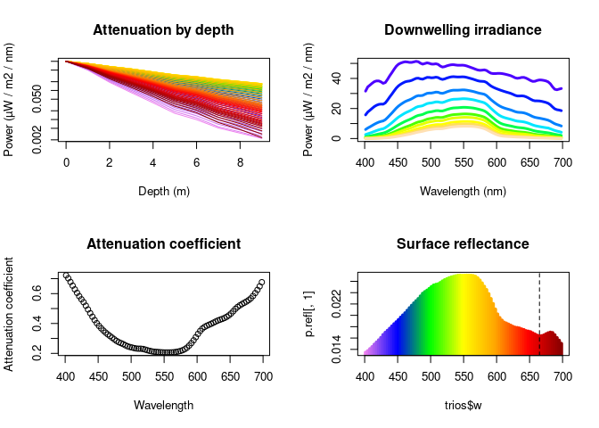

## AQUA utility functions (aquautil)

This package contains a set of utility functions to do tasks regularly
done at the AQUA section at the University of Oslo. So far, the package
only contains function for reading and summarizing light measurement
data.

### Installation

You need the `devtools` package to install `aquautil` from github.
Running the following chunk installs `aquautil`, and also `devtools` if
you don’t already have it installed.

``` r
if (!require(devtools)){
  install.packages("devtools")
}
devtools::install_github("evengar/aquautil")
```

### Light measurement data

*Warning: the functions in the package are not properly tested. Use at
your own risk, and verify that results seem correct.*

The package contains functions for analyzing data generated by
[Ramses](https://www.trios.de/en/ramses.html) irradiance sensors (TriOS
GmbH). There are three sensors, measuring upwelling and downwelling
irradiance in water, as well as irradiance in the air for calibration.
Each sensor outputs a separate data file with sensor name, date and time
in the file name.

The function `read_trios()` reads trios files for a single cast,
synchronizing the sensors and put them all into a “trios” object. You
need to at least provide the path to your files, and the depth at which
measurements were taken.

``` r
library(aquautil)
# locate example files
# replace with the path to your directory to use your own data
directory <- system.file("extdata", "trios_march", package = "aquautil")

# the data has depths from 0-9 in increments of 1
trios <- read_trios(directory, depths = 0:9)
```

For this to work, you need to provide the same number of depths that you
have files per sensor, in the order you took the measurements.
`read_trios()` does not perform any checks apart from the number of, so
make sure your files are in order!

The resulting file is a “trios” object, and you can perform a few
operations on it:

``` r
# printing gives a quick summary of the depths and wavelengths
trios
```

    ## Trios object with 10depths: 
    ## 0 1 2 3 4 5 6 7 8 9 meters 
    ##  
    ## and 255 wavelengths, ranging from 
    ## 305.1 to 1146.45 nm

``` r
# length returns number of depths
length(trios)
```

    ## [1] 10

``` r
# dim returns number of wavelengths and depths
dim(trios)
```

    ## [1] 255  10

Normalize the data to surface values with

``` r
# relative_to_surface will set depth 0 measurements to 1, and the rest relative
# to that one. Useful for plotting depth attenuation.
trios_normalized <- normalize_to_surface(trios, relative_to_surface = FALSE)
```

You can subset the data to within certain wavelengths with the function
`subset_to_wavelength()`

``` r
# subset to par region (default)
trios_par <- subset_to_wavelength(trios_normalized, 400, 700)
trios_par
```

    ## Trios object with 10depths: 
    ## 0 1 2 3 4 5 6 7 8 9 meters 
    ##  
    ## and 90 wavelengths, ranging from 
    ## 401.4 to 698.14 nm

`plot()` creates a summary plot of the data

``` r
plot(trios_par)
```

<!-- -->

There are also functions for making the individual plots, like
`plot_attenuation_coefficient()`, and functions for doing the
calculations in the plot, like `attenuation_coefficient()`.

Apart from a few extra utilities, like better subsetting, this is pretty
much all I plan for the trios functions to do. If you want to do more
in-depth analysis of the data, you can use `as.data.frame` to generate a
long format data frame to work with.

``` r
trios_df <- as.data.frame(trios_par)

library(ggplot2)
ggplot(trios_df, aes(w, irradiance, color = factor(depth))) +
  geom_line() +
  facet_wrap(~sensor)
```

<!-- -->
